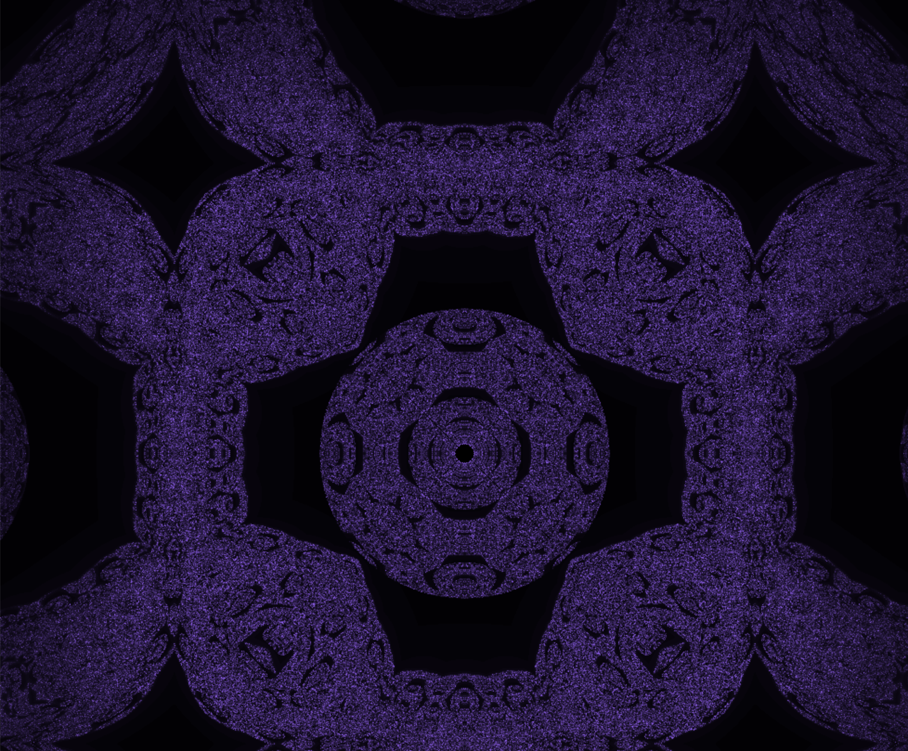

# Fractol

Welcome to my Fractol project repository. This project is part of the 42 curriculum and involves creating a basic computer graphics application to explore the fascinating world of fractals using the MiniLibX library. You will be able to visualize the Julia set, the Mandelbrot set and the Mandelbox set, zoom into them, change the resolution and experiment with different parameters to see the beautiful complexity of these mathematical objects.


  


## Table of Contents

- [Introduction](#introduction)
- [Features](#features)
- [Installation](#installation)
- [Usage](#usage)
- [Explanation](#explanation)

## Introduction

A fractal is an abstract mathematical object, like a curve or a surface, whose pattern remains the same at every scale. The term "fractal" was first used by mathematician Benoit Mandelbrot in 1974, based on the Latin word "fractus," meaning "broken" or "fractured." Various natural phenomena, such as the romanesco cabbage, exhibit fractal features.

 

This project leverages the MiniLibX graphical library to render and explore fractals. The MiniLibX library includes the basic tools necessary to open a window, create images, and handle keyboard events.

## Features

- **Fractal Sets:** Render the Julia, Mandelbrot or Mandelbox set.
- **Zooming:** Use the W and S keys to zoom in and out, exploring the fractals almost infinitely.
- **Dynamic Julia Sets:** Create different Julia sets by passing various parameters to the program.
- **Rendering Options:** Define fractal types and rendering options through command line parameters.
- **Psychedelic Colors:** Use the key "lsd" in the command line to render some psychedelic color effects.

## Installation

Clone the repo
```
git clone https://github.com/btoksoez/fractol.git
```
Make
```
make
```

## Usage
To render the Mandelbrot set:
```
./fractol mandelbrot {lsd}
```
To render the Julia set, specify parameters, for example:
```
./fractol julia {-0.8 0.156} {lsd}
```
Replace {parameters} with actual values that create a visually appealing Julia set.

To render the Mandelbox set:
```
./fractol mandelbox {lsd}
```
The lsd parameter will render a psychedelic color palette for the selected fractal.

## Explanation
Fractals like the Mandelbrot and Julia sets are mathematical constructs that exhibit self-similar patterns at different scales. In this project, each pixel's color is determined by calculating whether it belongs to the fractal set based on iterative computations. Here’s a simplified example of calculating the Mandelbrot set:
```
int mandelbrot(t_complex c, t_fractal *fractal)
{
    t_complex z;
    double temp_imag;
    int i;
    double magnitude;
    int color;

    z.real = 0;
    z.imag = 0;
    i = 0;
    while (i < fractal->max_iter)
    {
        magnitude = z.real * z.real + z.imag * z.imag;
        if (magnitude > (fractal->threshold * fractal->threshold))
        {
            if (fractal->fast == 1)
                return (map(i, fractal->max_iter, GRAD_START, GRAD_END));
            color = map(i, fractal->max_iter, 0, 256);
            return (fractal->palette[color]);
        }
        temp_imag = 2 * z.real * z.imag + c.imag;
        z.real = (z.real * z.real) - (z.imag * z.imag) + c.real;
        z.imag = temp_imag;
        i++;
    }
    return (GRAD_START);
}
```
In this code:
- z is iteratively updated to determine if it escapes to infinity.
- c represents a point in the complex plane.
- max_iter defines the maximum number of iterations before deciding a point is in the set.
- threshold is a predefined value to check the magnitude of z.
- map function translates the number of iterations into a color gradient.

This process is repeated for each pixel to generate the fractal image, showcasing the intricate and mesmerizing patterns of fractals.

Feel free to explore, zoom in, change parameters, and enjoy the beauty of fractals with this project!


